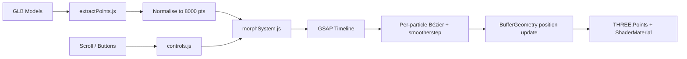

# Particle Morph

> **Yoeki Soft Technical Assessment — Task 1**  
> 3D Particle Morphing Sequence · Creative UI Developer (Motion & Interactive)

An interactive WebGL experience where a single point cloud smoothly morphs between four 3D shapes. Inspired by the particle transitions on [indium.tech](https://www.indium.tech/), built from scratch with Three.js, custom GLSL shaders, and GSAP-driven interpolation.

---

## Live Demo

| | |
|---|---|
| **Deployed URL** | _Add your Vercel / Netlify / GitHub Pages link here_ |
| **Repository** | [Ayush3205/Motion-Interactive](https://github.com/Ayush3205/Motion-Interactive) |

---

## Overview

The scene renders **8,000 particles** as a `THREE.Points` mesh. Each shape is loaded from a `.glb` file, its vertex positions are sampled and normalised to a fixed count, and morphing is triggered by the user — scroll by default, or prev/next buttons if configured.

Transitions are not instant swaps. Every particle follows its own timed path through 3D space using a **custom easing curve** and a **quadratic Bézier arc**, so the cloud flows organically between forms instead of snapping.

---

## Shape Sequence

Four morph targets with deliberate screen placement:

| # | Shape | GLB File | Screen Offset | Alignment |
|---|-------|----------|---------------|-----------|
| 01 | Indium Logo | `shape1.glb` | `(0, 0, 0)` | Centre |
| 02 | Sphere | `shape2.glb` | `(0, 0, 0)` | Centre |
| 03 | Light Bulb | `shape3.glb` | `(2.5, 0, 0)` | Right |
| 04 | Heart | `shape4.glb` | `(-2.5, 0, 0)` | Left |

The Indium logo, light bulb, and heart use custom procedural geometry (exported to GLB). A procedural fallback exists in `shapeGenerators.js` if any file fails to load.

---

## Features

### Assessment requirements

- [x] Minimum 4 distinct morph targets from GLB models
- [x] Varied model positions (centre / right / left)
- [x] User-triggered morphing via scroll (buttons optional)
- [x] Smooth per-particle interpolation — no hard jumps
- [x] Custom transition curve (smootherstep + Bézier scatter arcs)

### Additional polish

- Staggered particle delays for a rolling wave effect during morphs
- Additive-blended particle glow with size attenuation in the vertex shader
- Mouse-driven camera parallax
- Gentle idle float animation on the active shape
- Ambient Y-axis rotation between morphs
- Progress bar synced to morph timeline
- Loading state and fatal error handling

---

## How It Works



### 1. Model loading (`loadModel.js`)

`GLTFLoader` fetches each shape from `public/shapes/`. On failure, procedural geometry from `shapeGenerators.js` is used so the demo still runs.

### 2. Point extraction (`extractPoints.js`)

Vertices are read from each mesh (or merged geometry), then resampled to exactly **8,000 points** so every shape shares the same particle count — required for position-to-position morphing.

### 3. Morph engine (`morphSystem.js`)

Each transition runs over **2.2 seconds** via GSAP:

| Step | What happens |
|------|----------------|
| Stagger | Each particle gets a random delay (up to 45% of duration) |
| Easing | Ken Perlin's **smootherstep** applied per particle |
| Path | **Quadratic Bézier** through a random outward scatter midpoint |
| Offset | Shape group position lerps to the target alignment |

### 4. Rendering

Custom `ShaderMaterial` on `THREE.Points`:
- **Vertex shader** — perspective-correct point sizing with per-particle randomness
- **Fragment shader** — soft circular falloff, white-to-cyan colour mix, additive blending

---

## Controls

| Input | Action |
|-------|--------|
| Scroll down | Morph to next shape |
| Scroll up | Morph to previous shape |
| Mouse move | Camera parallax |

**Switch to button navigation:** open `src/controls.js` and change:

```js
const TRIGGER_MODE = 'buttons';
```

---

## Tech Stack

| Layer | Library |
|-------|---------|
| 3D / WebGL | [Three.js](https://threejs.org/) r165 |
| Animation | [GSAP](https://gsap.com/) 3.12 |
| Bundler | [Vite](https://vitejs.dev/) 5 |

---

## Getting Started

### Prerequisites

- Node.js 18+
- npm

### Install & run

```bash
cd particle-morph
npm install
npm run dev
```

App opens at `http://localhost:3000`.

### Production build

```bash
npm run build
npm run preview
```

### Regenerate GLB assets

Models in `public/shapes/` were exported from the procedural geometry:

```bash
npm run export:glb
```

---

## Deployment

Works on any static host. Example with **Vercel**:

1. Import the GitHub repo
2. Set **Root Directory** to `particle-morph`
3. Build command: `npm run build`
4. Output directory: `dist`

Repeat as a separate project for `wave-sphere`.

---

## Project Structure

```
particle-morph/
├── public/
│   └── shapes/
│       ├── shape1.glb      # Indium logo
│       ├── shape2.glb      # Sphere
│       ├── shape3.glb      # Light bulb
│       └── shape4.glb      # Heart
├── scripts/
│   └── export-glb.mjs      # GLB export utility
├── src/
│   ├── main.js             # Entry point, render loop
│   ├── scene.js            # Renderer, camera, lights
│   ├── loadModel.js        # GLTFLoader + fallbacks
│   ├── extractPoints.js    # Vertex sampling & normalisation
│   ├── morphSystem.js      # Morph logic, shaders, point cloud
│   ├── controls.js         # Scroll / button input, parallax
│   └── shapeGenerators.js  # Procedural logo geometry
├── index.html
├── package.json
└── vite.config.js
```

---

## Configuration Reference

| Constant | File | Default | Purpose |
|----------|------|---------|---------|
| `TARGET_POINTS` | `extractPoints.js` | `8000` | Particles per shape |
| `MORPH_DURATION` | `morphSystem.js` | `2.2` | Transition length (seconds) |
| `STAGGER_SPREAD` | `morphSystem.js` | `0.45` | Max per-particle delay ratio |
| `SCATTER_STRENGTH` | `morphSystem.js` | `0.6` | Bézier arc spread |
| `TRIGGER_MODE` | `controls.js` | `'scroll'` | `'scroll'` or `'buttons'` |
| `SCROLL_THRESHOLD` | `controls.js` | `50` | Wheel delta to trigger morph |

---

## Author

**Ayush** — [GitHub @Ayush3205](https://github.com/Ayush3205)
