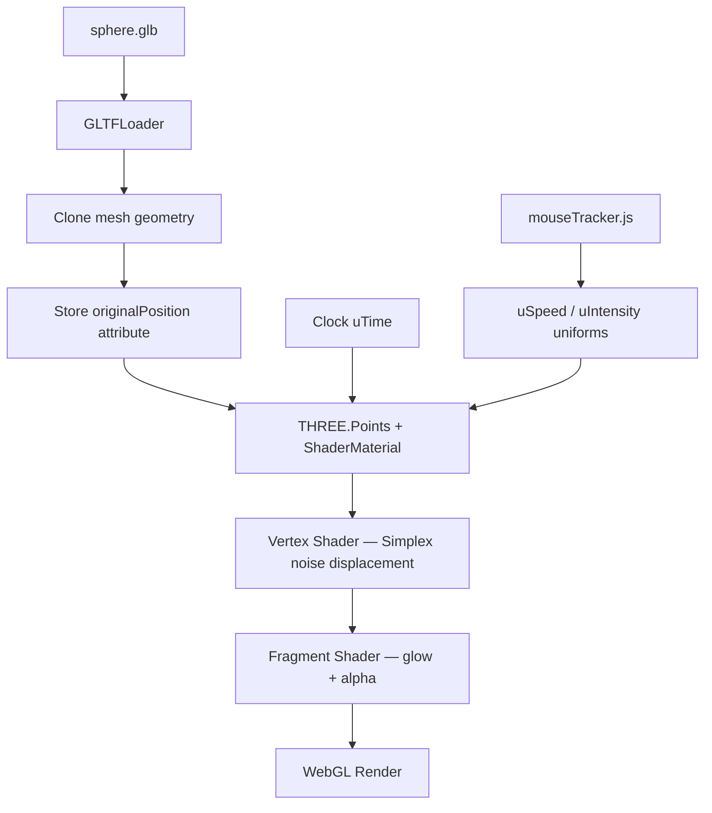

# Wave Sphere

> **Yoeki Soft Technical Assessment — Task 2**  
> Noise Particle Displacement on a Point Cloud Sphere · Creative UI Developer (Motion & Interactive)

A real-time WebGL particle sphere whose surface ripples and shifts using **3D Simplex noise computed entirely on the GPU**. Cursor movement controls how fast and how strongly the waves move — slow drift when idle, energetic displacement when the mouse moves quickly.

---

## Live Demo

| | |
|---|---|
| **Deployed URL** | _Add your Vercel / Netlify / GitHub Pages link here_ |
| **Repository** | [Ayush3205/Motion-Interactive](https://github.com/Ayush3205/Motion-Interactive) |

---

## Overview

A dense sphere model is loaded from `sphere.glb`, converted to a `THREE.Points` point cloud, and animated through a custom `ShaderMaterial`. The original vertex positions are stored as a buffer attribute (`originalPosition`) so the GPU can displace outward along each point's normal without losing the base shape.

The result is a hollow, glowing shell of thin particle strands that continuously deform — similar to the reference `sphere.mp4` from the assessment brief.

---

## Features

### Assessment requirements

- [x] GLB model loaded and rendered exclusively as a point cloud (`THREE.Points`)
- [x] Custom GLSL vertex shader with 3D noise displacement on the GPU
- [x] Thin, glowing particles forming a shifting hollow wave structure
- [x] Displacement speed and intensity react to cursor movement

### Additional polish

- Layered noise (two octaves of Simplex noise) for richer surface detail
- Fragment shader glow with noise-driven brightness variation
- Additive blending for a luminous particle look
- Perspective-correct point sizing tied to noise value
- Slow ambient rotation for depth
- Procedural sphere fallback if the GLB fails to load
- Debounced window resize handling

---

## How It Works



### 1. Point cloud setup (`pointCloud.js`)

- Loads `/shapes/sphere.glb` via `GLTFLoader`
- Clones the mesh geometry and copies positions into `originalPosition`
- Creates `THREE.Points` with a custom `ShaderMaterial`
- Falls back to `SphereGeometry(2, 224, 224)` if loading fails

### 2. GPU displacement (`shaders/vertex.glsl.js`)

Simplex noise (`snoise`) runs per vertex on the GPU:

```glsl
float noise1 = snoise(originalPosition * 1.5 + uTime * uSpeed);
float noise2 = snoise(originalPosition * 3.0 + uTime * uSpeed * 1.5) * 0.5;
float n = noise1 + noise2;

vec3 newPosition = originalPosition + norm * n * uIntensity;
```

| Uniform | Driven by | Effect |
|---------|-----------|--------|
| `uTime` | `THREE.Clock` elapsed time | Animates the noise field |
| `uSpeed` | Mouse velocity | Faster cursor → faster waves |
| `uIntensity` | Mouse velocity | Faster cursor → stronger displacement |
| `uPointSize` | Static (2.0) | Base particle size |

### 3. Visual styling (`shaders/fragment.glsl.js`)

- Soft radial alpha falloff per particle (circular point sprite)
- Cyan-white base colour (`0.6, 0.9, 1.0`)
- Brightness modulated by the noise value passed from the vertex shader
- Additive blending for the glow effect

### 4. Mouse interaction (`mouseTracker.js`)

Tracks cursor position each frame, calculates velocity from frame-to-frame distance, normalises it, and smoothly lerps shader uniforms:

| Mouse state | `uSpeed` | `uIntensity` |
|-------------|----------|--------------|
| Idle / slow | `0.15` | `0.08` |
| Fast movement | up to `0.60` | up to `0.35` |

Damping prevents abrupt jumps when the cursor stops.

---

## Controls

| Input | Action |
|-------|--------|
| Mouse movement | Increases wave speed and displacement intensity |
| Idle cursor | Gentle, slow ambient ripple |

---

## Tech Stack

| Layer | Library |
|-------|---------|
| 3D / WebGL | [Three.js](https://threejs.org/) r165 |
| Shaders | Custom GLSL (Simplex noise, inline via `.glsl.js`) |
| Bundler | [Vite](https://vitejs.dev/) 5 |

---

## Getting Started

### Prerequisites

- Node.js 18+
- npm

### Install & run

```bash
cd wave-sphere
npm install
npm run dev
```

App opens at `http://localhost:3000`.

### Production build

```bash
npm run build
npm run preview
```

---

## Deployment

Works on any static host. Example with **Vercel**:

1. Import the GitHub repo
2. Set **Root Directory** to `wave-sphere`
3. Build command: `npm run build`
4. Output directory: `dist`

---

## Project Structure

```
wave-sphere/
├── public/
│   └── shapes/
│       └── sphere.glb        # Dense sphere mesh (~2.1 MB)
├── src/
│   ├── main.js               # Render loop, uniform updates
│   ├── scene.js              # Renderer, camera, clock, resize
│   ├── pointCloud.js         # GLB load, geometry + material setup
│   ├── mouseTracker.js       # Cursor velocity → shader uniforms
│   └── shaders/
│       ├── vertex.glsl.js    # Simplex noise displacement
│       └── fragment.glsl.js  # Particle glow and alpha
├── index.html
├── package.json
└── vite.config.js
```

---

## Shader Uniforms Reference

| Uniform | Type | Default | Updated |
|---------|------|---------|---------|
| `uTime` | `float` | `0` | Every frame (`clock.getElapsedTime()`) |
| `uSpeed` | `float` | `0.15` | Every frame (mouse velocity) |
| `uIntensity` | `float` | `0.08` | Every frame (mouse velocity) |
| `uPointSize` | `float` | `2.0` | Static |

### Attributes

| Attribute | Purpose |
|-----------|---------|
| `position` | Current displaced vertex position |
| `originalPosition` | Rest pose from the GLB mesh |

---

## Performance Notes

- Sphere GLB contains ~55k vertices; all displacement runs on the GPU
- `depthWrite: false` and additive blending keep overdraw manageable
- Pixel ratio capped at `2` for retina displays without excessive fill cost

---

## Author

**Ayush** — [GitHub @Ayush3205](https://github.com/Ayush3205)
